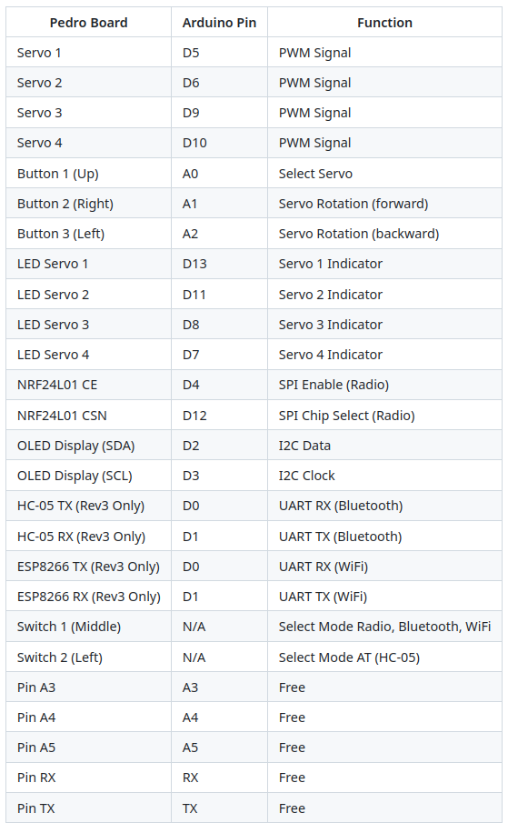

# 📂 Pedro Board

## Two versions: 

- **Rev2**: **NRF24L01** + **OLED 128x64**
- **Rev3**: Rev2 + **ESP8266-01** + **HC-05**

## Pedro Board Rev3: 

    

- **OLED Screen (128x64)**: Visualize data, debug in real-time, or create interactive menus.
- **NRF24L01**: Enable long-range wireless communication between Pedro or devices.
- **ESP8266-01 WiFi Module**: Bring your Pedro online with ease. (**Rev3 only**)
- **HC-05 Bluetooth Module**: Connect wirelessly to smartphones or other devices. (**Rev3 only**)
  

    

## ✅ Do It Yourself

Want to build Pedro from scratch? You can make your own Pedro Board by using the [Gerber file](src="PedroBoard_Rev3").  
When you get your board, the microcontroller ATmega32u4 doesn’t have the correct bootloader yet, it's delivered with the factory bootloader. To make Pedro work with Arduino IDE, you first need to flash the Arduino Pro Micro bootloader into the Pedro board using the SPI pins as described below.

    

## 🛠️ What You Need:

- Your Pedro board (of course)
- PC with Arduino IDE installed
- An Arduino Pro Micro
- A Micro USB cable
- Some wires

## 📌 How to flash the bootloader?:

- Open Arduino IDE
- Connect the Arduino Pro Micro to the PC
- Select Arduino Pro Micro (ATmega32U4) as the target board
- Upload the "File" -> "Exemple" -> "Arduino as ISP" sketch to the Arduino Pro Micro
- When the upload is done disconnect the Arduino Pro Micro from the PC
- Connect the SPI pins of the Pedro board to the Arduino Pro Micro as shown:
    - Pedro Board => Arduino Pro Micro
    - GND         =>      GND (black)
    - VCC         =>      VCC (red)
    - SCK         =>      15 (orange)
    - MI          =>      14 (purple)
    - MO          =>      16 (green)
    - RST         =>      10 (yellow)
- Re-Connect the Arduino Pro Micro to the PC
- Select Arduino Pro Micro (ATmega32U4) as the target board
- Go to Tools > Burn Bootloader

🎯 Once done, disconnect the SPI wiring, plug the Pedro board to the PC and check in "Tools > Port" to ensure the board is recognized by Arduino IDE.

    

## Mapping Board Rev3 & Arduino

    

---
